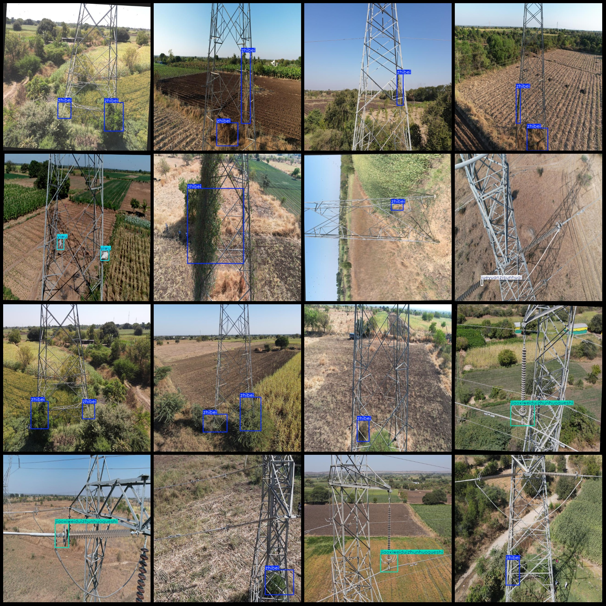
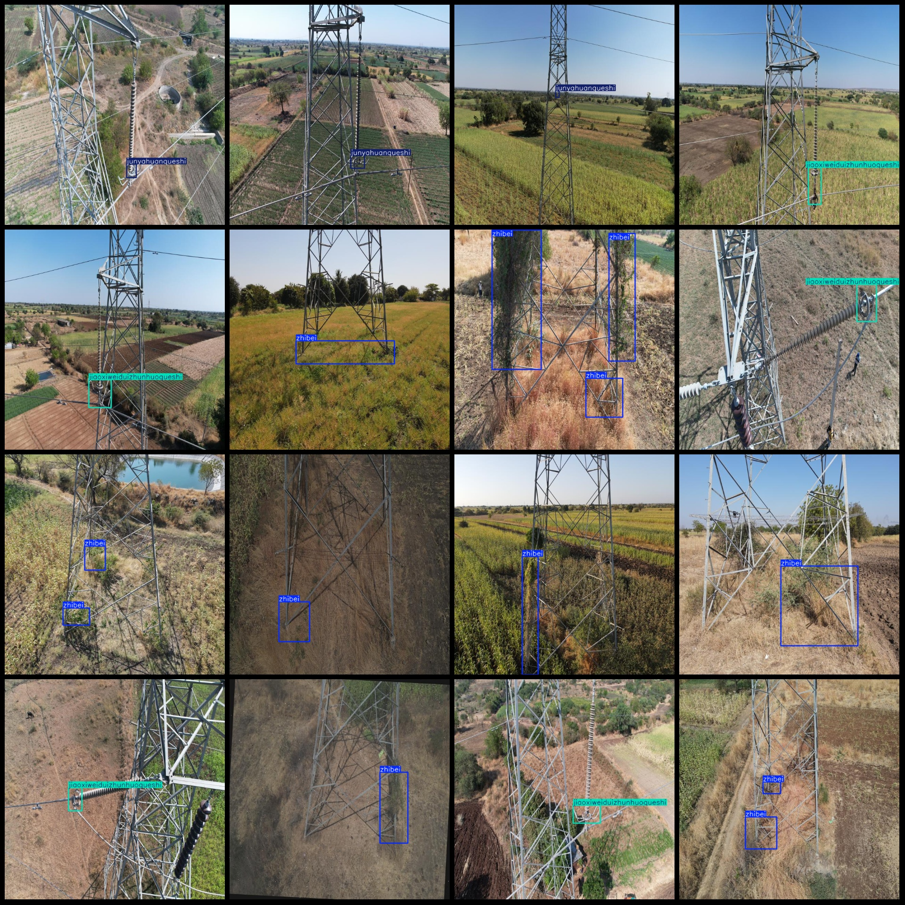

# High Voltage Line Anomaly Power Inspection Data Set in Drone Perspective with VOC+YOLO Format and 1,163 Images in 9 Categories

Dataset format: Pascal VOC format + YOLO format (txt file without split path, only contains jpg images and corresponding VOC format xml files and YOLO format txt files)
Number of images (number of jpg files): 1163
Number of XML files: 1163
Number of txt files: 1163
Category: 9
["Daoxianjiexiancuowu", "Fangzhenchuiqueshi", "Jiaoxiweiduizhunhuoqueshi", "JiediXiangZhang", "Jueyuanzisunhuai", "Junyahuanqushi", "Luoshanluomisongdong", "Yiwu", "Zhibei"]
1. Wiring error
2. Vibration hammer missing
3. Angle gap not aligned or missing
4. Grounding line fault
5. Insulator damaged
6. Impact ring missing
7. Bolt and nut loose
8. Foreign object
9. Vegetation
Number of boxes labeled per category:
daoxianjiexiancuowu box count = 63  
frames = 40
"jiaoxiweiduizhunhuoqueshi box count = 434" can be translated to "The number of boxes in the jiaoxiweiduizhunhuoqueshi is 434."
jiedixianguzhang box count = 10
Jueyuanzisunhuai box count = 103
"junyahuanqueshi box count = 94" is translated to English as "The number of frames for 'Junya Huan Que Shi' is 94."
Luoshanluomisongdong Frame = 71
"yiwu" is a Chinese word that translates to "one hundred and sixty".
520
Total Frames: 1461
images per class:   
daoxianjiexiancuowu images = 60  
fangzhenchuiqueshi images = 35  
Jaoxiweiduizhunhuoqueshi = 414
The number of pictures owned is 10.
"Jueyuanzisunhuai" is a Chinese character that translates to "Jueyuanzi Sunhuai". The number 92 is also a Chinese character that translates to "92".
"Junyahuanqueshi" has 91 pictures.
Luoshan Luomusongdong possesses 59 images.
106
The number of images Zhibei owns = 374.
image resolution: 640x640  
Use a labeling tool: labelImg
Annotation Rule: Draw a rectangle around the class.
Important Notes: The dataset does not have separate training, validation, or test sets. You need to partition them yourself.
Special statement: This dataset does not guarantee the accuracy of the trained model or the weight files.
Image Preview:
## Images

Here is a pay link on Stripe ( https://buy.stripe.com/3cs8yP7sY87d0vu9AB ). Please contact me lonlonago@foxmail.com after funding $89, and I will send you a complete data files , thank you!

